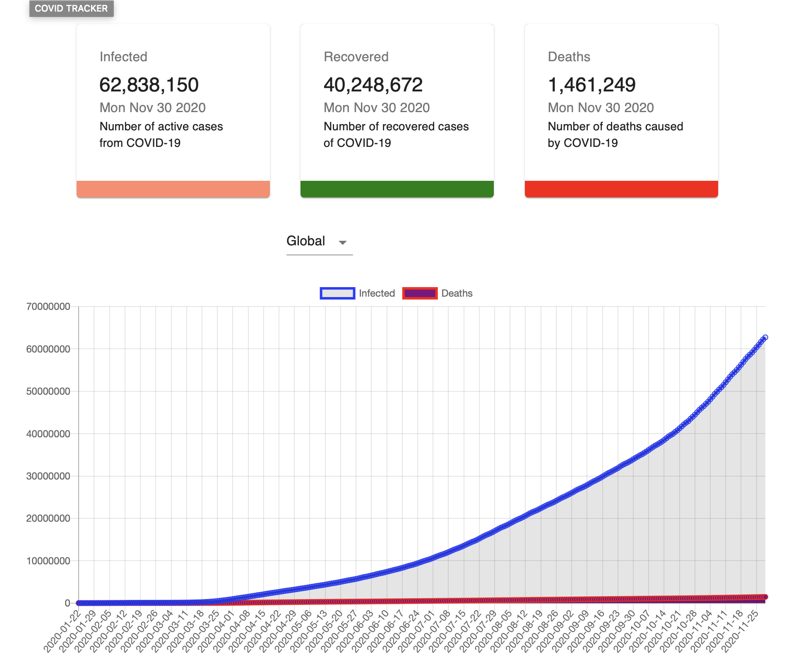
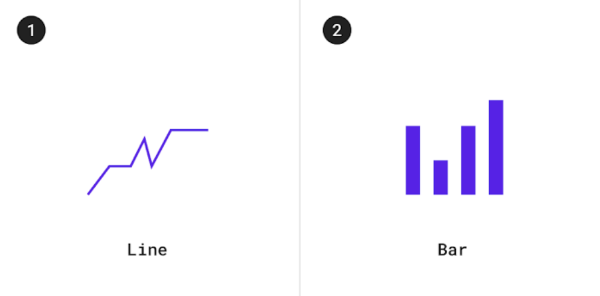
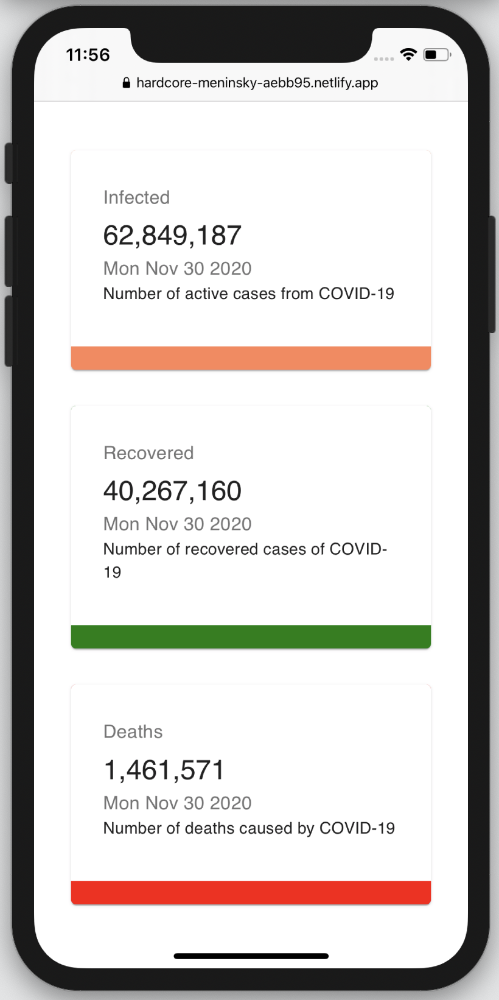
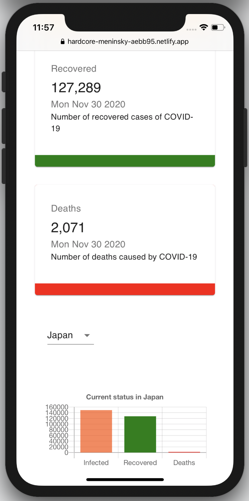

## [COVID TRACKER 19](https://hardcore-meninsky-aebb95.netlify.app) &emsp; &nbsp;

 

## Description
A web app that provides detailed information on local and global coronavirus, covid-19, cases with active, recoveries, and death rate for each country and the global total. 
 
The Covid Tracker-19 collects and publishes the most complete data avialable. Covid tracker-19 charts, infected, recovered, and deaths are based on data collected by the John Hopkins University.
 
 

* **Data visualization** depicts information in a graphical form in both line charts and bars.
* **Selection of countries** from a drop down menu select from global or individual countries. Providing detail information on infections, recoveries, and death totals.
  
* **Responsive design** The design and development of the web app response to the user's platform, screen size, and device orientation.
  
   

 

## Web App

The web app was deployed in **Netlify** and is avialable for use. The data that is used by the charts in the web app is being provided by the **John Hopkins University** CSSE as a JSON API [JSON API](https://covid19.mathdro.id/api)

 

## Site

#### Landing page

<kbd></kbd>

 

#### Types of charts

<kbd></kbd>

#### Mobile support
  
 
The web app is responsive and designed and developed with a mobile first approach.

 

<kbd></kbd>
<kbd></kbd>

## Feedback
Feel free to send us feedback on Twitter .  or file an issue. Feature requests are always welcome. If you wish to contribute.

## Built with

    
   

  * **React.js** - A JavaScript library for building user interfaces. **Declarative** with views and state management. **Component-based** Build encapsulated components that manage their own state, then compose them to make complex UIs.
  * **Matarial-UI** - the data you want to communicate, and what you want to convey about that data.

### Roadmap

Support for app will continue with future implemations.

### Author

Minierparedes

### License

For open source projects.

